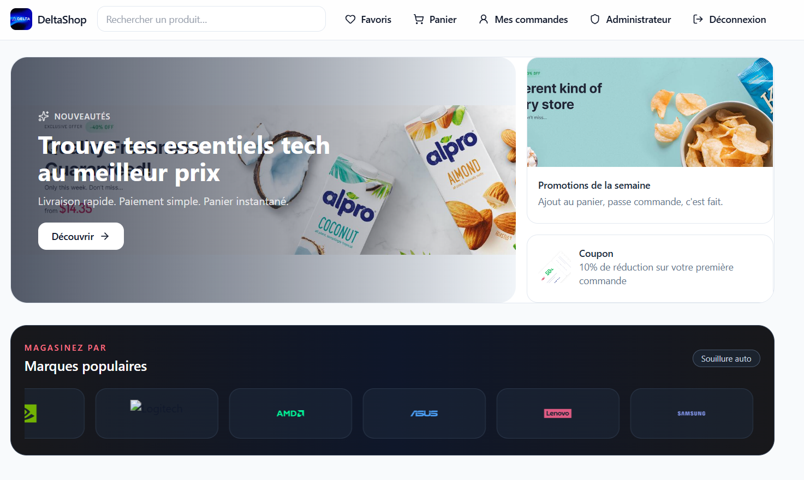
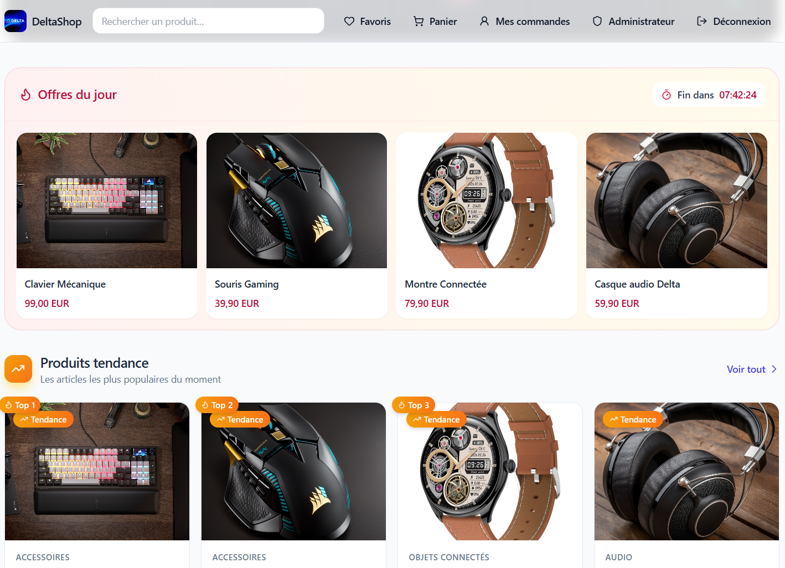
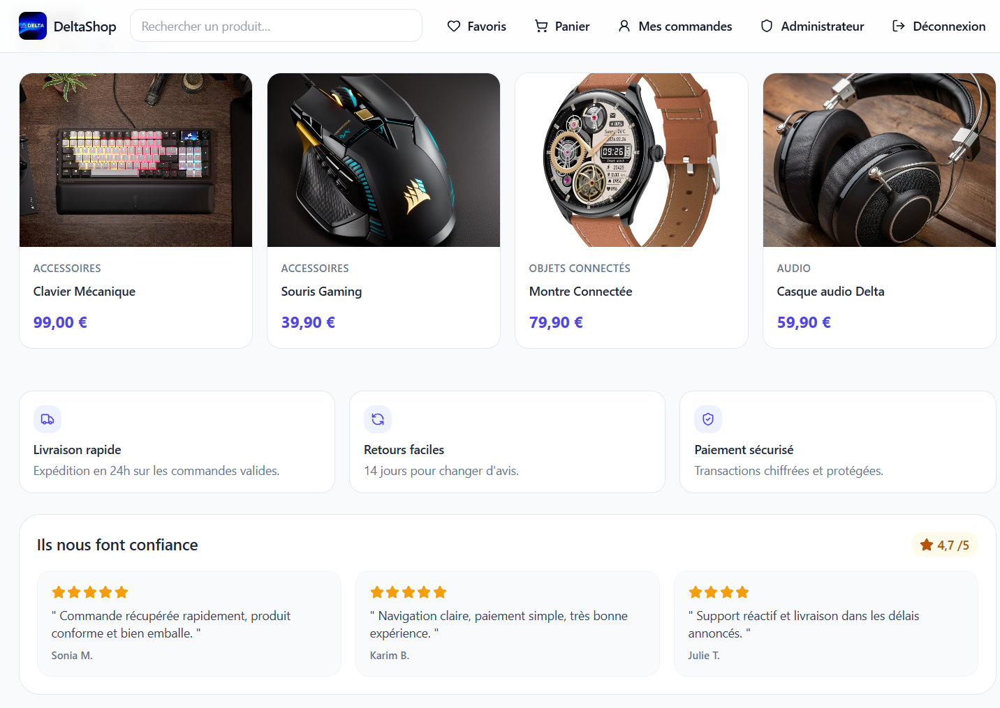
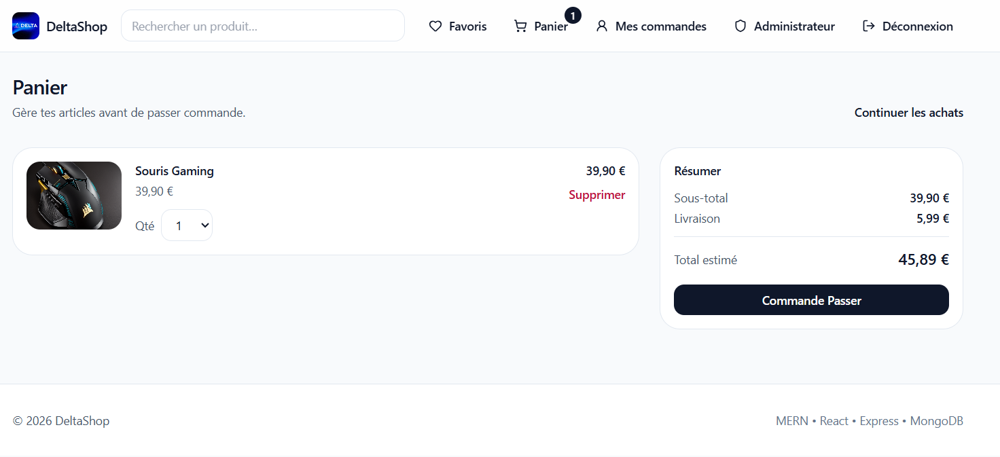
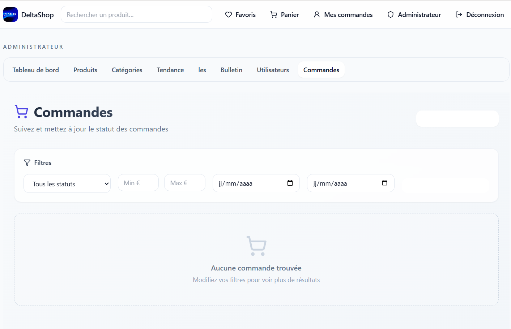
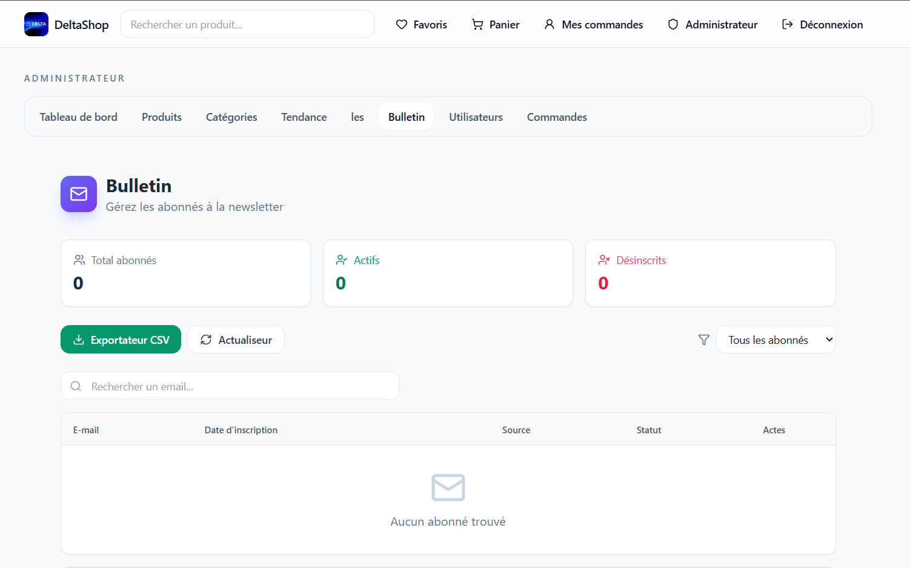

#  DeltaShop - E-commerce Full-Stack MERN

**DeltaShop** est une plateforme e-commerce moderne et complète construite avec la stack **MERN** (MongoDB, Express, React, Node.js). Le projet offre une expérience d'achat intuitive avec un back-office administrateur puissant pour la gestion des produits, utilisateurs et commandes.

**Lien démo** : http://localhost:5173

---

##  À Propos du Projet

DeltaShop est conçu comme une solution e-commerce complète pour les petits et moyens commerces. Elle combine une interface client moderne et responsive avec un système d'administration robuste. Que vous soyez vendeur ou client, DeltaShop offre toutes les fonctionnalités essentielles pour une expérience d'achat en ligne optimale.

---

##  Galerie du Projet

###  Interface Boutique



La page d'accueil présente un catalogue dynamique avec des produits en vedette, des filtres par catégorie et une barre de recherche performante. L'interface est entièrement responsive et s'adapte à tous les appareils.



Les utilisateurs peuvent parcourir facilement les produits avec pagination, voir les avis clients, et accéder aux offres spéciales du jour. Chaque produit affiche son prix, ses réductions et sa note moyenne.



###  Gestion Panier & Commandes



Le panier est persistant et utilise le localStorage du navigateur pour conserver vos articles. Vous pouvez ajouter, modifier les quantités ou supprimer des produits en temps réel. Les totaux se calculent automatiquement avec les taxes et frais de port.



La création de commande est simple et sécurisée. Les utilisateurs peuvent voir l'historique complet de leurs commandes et les détails de chaque achat, y compris le statut et les informations d'expédition.

###  Espace Personnel


Chaque utilisateur peut gérer sa liste de souhaits, garder ses produits favoris et les consulter à tout moment. Cette liste est synchronisée en base de données et permet de monétiser les récommandations.


Les produits tendance sont mis en avant sur l'accueil et dans le profil utilisateur pour encourager les découvertes et augmenter les ventes croisées.

###  Tableau de Bord Administrateur


Le dashboard admin offre une vue complète des statistiques clés : nombre de commandes, revenus totaux, utilisateurs actifs et tendances de vente. Les graphiques permettent de suivre les performances en temps réel.


La gestion des utilisateurs permet aux administrateurs de voir, modifier ou supprimer les profils clients. Cela inclut le suivi des historiques d'achat, des informations de contact et des préférences d'abonnement.

###  Newsletter



Les utilisateurs et visiteurs peuvent s'inscrire à la newsletter pour recevoir les dernières promotions et offres. Les administrateurs peuvent exporter la liste des abonnés en CSV pour des campagnes marketing ciblées.

---

##  Démarrage Rapide

### 1️ Prérequis
- **Node.js** 20+ recommandé
- **npm** 10+
- **Docker Desktop** (optionnel, pour MongoDB)

### 2️ Installation des dépendances
```bash
npm install
```
Cela installe les dépendances du backend et du frontend (monorepo avec workspaces npm).

### 3️ Configuration MongoDB

#### Option A : Docker (Recommandé)
```bash
docker-compose up -d
```
MongoDB sera accessible sur `mongodb://localhost:27017/deltashop`

#### Option B : MongoDB Local
Adapter la variable d'environnement `MONGO_URI` dans `.env` :
```env
MONGO_URI=mongodb://localhost:27017/deltashop
```

### 4️ Variables d'Environnement
Copier `.env.example` vers `.env` à la racine du projet :
```bash
cp .env.example .env
```

### 5️ Initialiser la Base de Données
```bash
npm run seed
```
Cela crée l'utilisateur admin et les données initiales (produits, avis, etc.).

### 6️ Lancer l'Application
```bash
npm run dev
```
- **Frontend** : http://localhost:5173
- **Backend API** : http://localhost:5000

---

##  Comptes de Test

### Compte Admin
```
Email    : admin@delta.com
Password : Admin123!
```

Pour accéder à l'admin : Connexion → Page Admin

---

##  Fonctionnalités Détaillées

###  Authentification & Utilisateurs

DeltaShop propose un système d'authentification complet et sécurisé. Les utilisateurs peuvent s'inscrire avec validation d'email pour prévenir les comptes frauduleux.

**Caractéristiques :**
-  Inscription avec validation d'email
-  Connexion/Déconnexion avec JWT
-  Gestion de profil utilisateur (modifier nom, email, photo)
-  Récupération de mot de passe (structure prête pour intégration email)
-  Dashboard utilisateur avec historique complet de commandes
-  Tokens JWT stockés sécurisement en localStorage
-  Authentification bearer token pour tous les appels API

###  Catalogue & Produits

Le cœur de la plateforme est son système de catalogue produits flexible et performant.

**Caractéristiques :**
-  Affichage du catalogue avec pagination configurable
-  Filtrage intelligent par catégorie, prix et disponibilité
-  Recherche full-text des produits optimisée
-  Page détaillée de produit avec images et descriptions complètes
-  Système d'avis et notes des clients (1-5 étoiles)
-  Produits tendance détectés automatiquement
-  Offres spéciales (Deals of the Day) configurables par l'admin
-  Produits récemment consultés sauvegardés localement
-  Affichage des stocks disponibles et des ruptures

###  Panier & Commandes

Le système de panier et de commandes est au cœur de la conversion client.

**Caractéristiques :**
-  Panier persistant grâce au localStorage (pas de perte de données)
-  Ajout/Suppression d'articles avec quantités configurables
-  Calcul automatique du total avec taxes
-  Application de codes de réduction (structure prête)
-  Création de commandes sécurisée et validée
-  Historique des commandes accessible à tout moment
-  Détails de chaque commande avec statut d'expédition
-  Suivi des dates de création et de modification

###  Liste de Souhaits

Permettez aux clients de sauvegarder leurs produits favoris pour les acheter plus tard.

**Caractéristiques :**
-  Ajouter/Retirer des produits favoris en un clic
-  Affichage de la wishlist personnelle et dédiée
-  Persistance en base de données MongoDB
-  Synchronisation entre les appareils (pour utilisateurs connectés)
-  Notifications lors de réductions sur les produits favoris

###  Newsletter

Construisez une liste de contacts pour vos campagnes marketing.

**Caractéristiques :**
-  Inscription simple à la newsletter en bas de page
-  Gestion des abonnés côté admin (voir, modifier, supprimer)
-  Export CSV des abonnés pour intégration marketing
-  Statut d'abonnement (actif/inactif)
-  Date d'inscription automatiquement enregistrée

###  Espace Administrateur

Le cœur du contrôle et de la gestion de votre e-commerce.

**Dashboard**
-  Statistiques en temps réel : revenus, commandes, utilisateurs
-  Graphiques de tendance de vente
-  Alertes sur les événements importants
-  Vue d'ensemble des performances clés

**Gestion Produits**
-  CRUD complet (Créer, Lire, Modifier, Supprimer)
-  Upload d'images produit
-  Gestion des stocks et disponibilités
-  Gestion des variantes (tailles, couleurs)
-  Fixation des prix et réductions
-  Marquage automatique des produits tendance

**Gestion Catégories**
-  Créer et organiser les catégories
-  Modifier les descriptions et images de catégories
-  Ordonner les catégories pour l'affichage

**Gestion Utilisateurs**
-  Voir la liste complète des utilisateurs
-  Consulter les détails de chaque compte
-  Voir l'historique d'achat de chaque client
-  Modifier les informations client
-  Désactiver/Supprimer les comptes
-  Voir les coordonnées de contact

**Gestion Commandes**
-  Suivi des commandes avec statut
-  Modification du statut de commande
-  Voir les détails de chaque commande
-  Générer les bordereaux de préparation
-  Filtrer par statut ou date

**Gestion Sliders**
-  Créer des bannières promotionnelles
-  Uploader des images de slide
-  Modifier l'ordre d'affichage
-  Activer/Désactiver les sliders

**Gestion Newsletter**
-  Voir tous les abonnés
-  Export CSV pour campagnes
-  Gestion des statuts d'abonnement
-  Suivi des dates d'inscription

###  Design & UX

L'expérience utilisateur est au cœur du design de DeltaShop.

**Caractéristiques :**
-  Interface responsive (mobile, tablette, desktop)
-  Thème sombre/clair structure prête pour implémentation
-  Animations et transitions fluides avec Tailwind CSS
-  Design moderne et accessible
-  Icônes cohérentes via Lucide React
-  Chargement optimisé des images

---

##  Structure du Projet

```
Delta-Commerce/
├── backend/                          # API Node.js/Express
│   ├── src/
│   │   ├── config/                  # Configuration MongoDB
│   │   │   └── database.js          # Connexion à la base de données
│   │   │
│   │   ├── controllers/             # Logique métier
│   │   │   ├── authController.js    # Authentification et tokens JWT
│   │   │   ├── productController.js # Gestion des produits
│   │   │   ├── orderController.js   # Gestion des commandes
│   │   │   ├── adminController.js   # Fonctions administrateur
│   │   │   ├── userController.js    # Gestion des profils utilisateurs
│   │   │   ├── cartController.js    # Gestion du panier
│   │   │   ├── wishlistController.js# Gestion de la liste de souhaits
│   │   │   └── newsletterController.js # Gestion de la newsletter
│   │   │
│   │   ├── models/                  # Schémas Mongoose
│   │   │   ├── User.js              # Modèle utilisateur
│   │   │   ├── Product.js           # Modèle produit
│   │   │   ├── Order.js             # Modèle commande
│   │   │   ├── Category.js          # Modèle catégorie
│   │   │   ├── Slider.js            # Modèle bannière
│   │   │   ├── Review.js            # Modèle avis produit
│   │   │   └── Newsletter.js        # Modèle abonné newsletter
│   │   │
│   │   ├── routes/                  # Routes API REST
│   │   │   ├── authRoutes.js        # Endpoints d'authentification
│   │   │   ├── productRoutes.js     # Endpoints produits
│   │   │   ├── orderRoutes.js       # Endpoints commandes
│   │   │   ├── adminRoutes.js       # Endpoints administrateur
│   │   │   ├── userRoutes.js        # Endpoints utilisateurs
│   │   │   └── newsletterRoutes.js  # Endpoints newsletter
│   │   │
│   │   ├── middleware/              # Middlewares Express
│   │   │   ├── authMiddleware.js    # Vérification JWT
│   │   │   ├── errorHandler.js      # Gestion centralisée des erreurs
│   │   │   ├── validationMiddleware.js # Validation des données
│   │   │   └── corsMiddleware.js    # Configuration CORS
│   │   │
│   │   ├── utils/                   # Utilitaires
│   │   │   ├── tokenUtils.js        # Génération et vérification JWT
│   │   │   ├── slugUtils.js         # Création de slugs URL
│   │   │   ├── imageUpload.js       # Configuration Multer
│   │   │   └── validation.js        # Schémas de validation
│   │   │
│   │   ├── data/                    # Données seed
│   │   │   ├── products.js          # Données produits initiales
│   │   │   ├── categories.js        # Catégories par défaut
│   │   │   └── seed.js              # Script de seeding
│   │   │
│   │   └── server.js                # Point d'entrée Express
│   │
│   ├── package.json                 # Dépendances backend
│   └── .env.example                 # Variables d'environnement exemple
│
├── frontend/                         # App React/Vite
│   ├── src/
│   │   ├── components/              # Composants React réutilisables
│   │   │   ├── Header.jsx           # En-tête avec navigation
│   │   │   ├── Footer.jsx           # Pied de page
│   │   │   ├── ProductCard.jsx      # Carte produit
│   │   │   ├── ProductList.jsx      # Liste de produits
│   │   │   ├── Cart.jsx             # Panier
│   │   │   ├── Navbar.jsx           # Barre de navigation
│   │   │   ├── SearchBar.jsx        # Barre de recherche
│   │   │   └── ...
│   │   │
│   │   ├── pages/                   # Pages (routes principales)
│   │   │   ├── HomePage.jsx         # Accueil
│   │   │   ├── ProductPage.jsx      # Détail produit
│   │   │   ├── ShopPage.jsx         # Page boutique/catalogue
│   │   │   ├── CartPage.jsx         # Page du panier
│   │   │   ├── CheckoutPage.jsx     # Paiement/Création commande
│   │   │   ├── OrderHistoryPage.jsx # Historique commandes
│   │   │   ├── WishlistPage.jsx     # Liste de souhaits
│   │   │   ├── AdminDashboardPage.jsx # Dashboard admin
│   │   │   ├── AdminProductsPage.jsx # Gestion produits
│   │   │   ├── AdminUsersPage.jsx   # Gestion utilisateurs
│   │   │   ├── LoginPage.jsx        # Connexion
│   │   │   ├── RegisterPage.jsx     # Inscription
│   │   │   └── ProfilePage.jsx      # Profil utilisateur
│   │   │
│   │   ├── features/                # Redux slices (gestion d'état)
│   │   │   ├── auth/                # Slice authentification
│   │   │   │   └── authSlice.js
│   │   │   ├── cart/                # Slice panier
│   │   │   │   └── cartSlice.js
│   │   │   ├── orders/              # Slice commandes
│   │   │   │   └── ordersSlice.js
│   │   │   ├── products/            # Slice produits
│   │   │   │   └── productsSlice.js
│   │   │   ├── wishlist/            # Slice liste de souhaits
│   │   │   │   └── wishlistSlice.js
│   │   │   └── ui/                  # Slice UI (thème, modales)
│   │   │       └── uiSlice.js
│   │   │
│   │   ├── lib/                     # Utilitaires et services
│   │   │   ├── api.js               # Client HTTP Axios
│   │   │   ├── image.js             # Traitement des images
│   │   │   ├── recentlyViewed.js    # Gestion des produits consultés
│   │   │   ├── storage.js           # Gestion localStorage
│   │   │   └── formatter.js         # Formatage de données
│   │   │
│   │   ├── hooks/                   # Custom React hooks
│   │   │   ├── useAuth.js           # Hook d'authentification
│   │   │   ├── useCart.js           # Hook du panier
│   │   │   ├── useFetch.js          # Hook pour requêtes API
│   │   │   └── useLocalStorage.js   # Hook localStorage
│   │   │
│   │   ├── App.jsx                  # Composant racine
│   │   ├── main.jsx                 # Point d'entrée React
│   │   ├── index.css                # Styles globaux
│   │   └── store.js                 # Configuration Redux Store
│   │
│   ├── public/                      # Assets statiques
│   │   └── favicon.ico
│   │
│   ├── package.json                 # Dépendances frontend
│   └── vite.config.js               # Configuration Vite
│
├── images/                          # Assets et logos du projet
├── Captures/                        # Screenshots et images du README
├── docker-compose.yml               # Configuration Docker pour MongoDB
├── package.json                     # Root package.json (workspaces)
├── .env.example                     # Template variables d'environnement
├── .gitignore                       # Fichiers ignorés par Git
└── README.md                        # Ce fichier
```

### Explication de l'Architecture

**Backend (Node.js/Express)**
- Le backend suit le pattern MVC avec séparation claire entre routes, contrôleurs et modèles
- MongoDB/Mongoose pour la persistance des données
- Middlewares personnalisés pour l'authentification et la gestion d'erreurs
- API RESTful sécurisée avec JWT

**Frontend (React/Vite)**
- Redux Toolkit pour la gestion centralisée de l'état
- React Router pour le routage côté client
- Composants modulaires et réutilisables
- Vite pour un développement rapide et un build optimisé

**Monorepo**
- Structure unifiée avec npm workspaces
- Commandes simplifiées (npm run dev lance les deux)
- Gestion centralisée des dépendances communes

---

##  Technologies Utilisées

### Backend
- **Express.js** - Framework web minimaliste et flexible
- **MongoDB** - Base de données NoSQL flexible
- **Mongoose** - ODM pour MongoDB avec validation de schéma
- **JWT** - Authentification stateless et sécurisée
- **bcryptjs** - Hash cryptographique des mots de passe
- **Multer** - Middleware pour l'upload de fichiers
- **Morgan** - Logger HTTP pour le debugging
- **CORS** - Contrôle des requêtes cross-origin

### Frontend
- **React 19** - Bibliothèque UI moderne avec hooks
- **Vite** - Build tool ultra-rapide avec hot reload
- **Redux Toolkit** - Gestion d'état prédictible et simplifiée
- **React Router 7** - Routage côté client
- **Axios** - Client HTTP Promise-based
- **Tailwind CSS** - Utilitaires CSS pour un design moderne
- **Lucide React** - Système d'icônes cohérent

---

##  Scripts Disponibles

### Root (Tous les commandes)
```bash
npm run dev              # Lance frontend + backend simultanément
npm run dev:backend     # Lance uniquement le backend (port 5000)
npm run dev:frontend    # Lance uniquement le frontend (port 5173)
npm run build           # Build le frontend pour production
npm run start           # Démarre le backend en production
```

### Backend
```bash
npm run dev             # Mode développement avec nodemon
npm run start           # Production
npm run seed            # Initialise la base de données avec les données par défaut
```

### Frontend
```bash
npm run dev             # Dev server Vite avec hot reload
npm run build           # Build pour production (optimisé)
npm run lint            # ESLint pour la qualité de code
npm run preview         # Prévisualise la build en local
```

---

##  Authentification & Sécurité

DeltaShop prend la sécurité au sérieux avec plusieurs couches de protection :

**JWT Bearer Token**
- Tokens stockés sécurisement en localStorage côté client
- Tokens envoyés en header Authorization pour chaque requête protégée
- Expiration des tokens configurable

**Hash Bcrypt**
- Tous les mots de passe sont hashés avec salt factor 10
- Les mots de passe ne sont jamais stockés en clair
- Vérification sécurisée lors de la connexion

**CORS**
- Contrôle strict des origines autorisées
- Protection contre les attaques cross-site

**Validation**
- Validation côté serveur de tous les inputs utilisateur
- Prévention des injections SQL et XSS
- Sanitization des données

---

##  Installation pour la Production

### Build Frontend
```bash
# Construire l'application React
npm run build

# Vérifier la build localement
npm run preview
```

### Déployer Backend
```bash
# S'assurer que NODE_ENV est défini à "production"
export NODE_ENV=production

# Démarrer le serveur
npm start
```

### Variables d'Environnement Production
```env
NODE_ENV=production
MONGO_URI=mongodb+srv://...  # Atlas ou serveur MongoDB
JWT_SECRET=your-secret-key-here
PORT=5000
VITE_API_URL=https://api.votredomaine.com
```

---

##  Dépannage

### MongoDB ne se connecte pas
```bash
# Vérifier que le conteneur Docker tourne
docker-compose ps

# Vérifier la variable MONGO_URI dans .env
# Par défaut: mongodb://localhost:27017/deltashop
```

### Erreur 401 - Authentification échouée
```bash
# Réinitialiser la base de données
npm run seed

# Vérifier le token JWT (console du navigateur)
# localStorage.getItem('token')
```

### Frontend ne se connecte pas à l'API
```bash
# Vérifier VITE_API_URL dans .env (frontend)
# Par défaut: http://localhost:5000

# Vérifier que le backend tourne sur le port 5000
netstat -tuln | grep 5000
```

### Erreur de port en conflit
```bash
# Modifier le port dans backend/.env
# PORT=5001

# Ou pour le frontend dans vite.config.js
# server: { port: 5174 }
```

---

##  Notes de Développement

**Architecture**
- Le projet utilise **ES Modules** (`type: "module"` dans package.json)
- Monorepo avec **npm workspaces** pour une gestion unifiée

**Hot Reload**
- **Nodemon** pour le rechargement automatique du backend
- **Vite** pour le rechargement ultra-rapide du frontend

**Gestion Centralisée d'Erreurs**
- Middleware d'erreur global qui standardise les réponses d'erreur

**Validation**
- Utilisation de schémas de validation côté backend
- Validation côté frontend pour une meilleure UX

---

##  Prochaines Étapes (À Venir)

-  Système de notifications en temps réel
-  Intégration de paiement (Stripe, PayPal)
-  Rapports et analytics avancés
-  Support multilingue
-  Application mobile React Native
-  Système de recommandation AI

---

##  Licence

MIT

---

**Auteur** : JOSEPH MUKUBU KAPOYA  
**Année** : 2026

**Version** : 1.0.0  
**Dernière mise à jour** : Juin 2026
